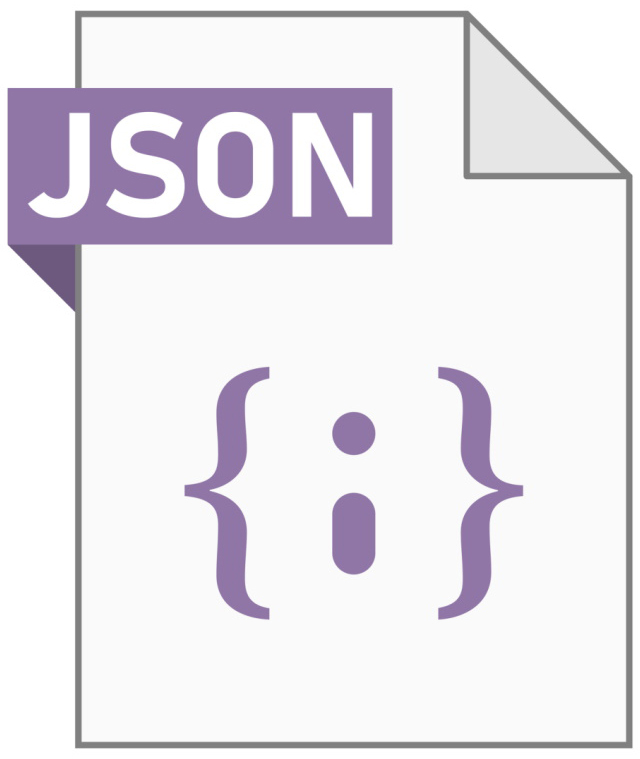
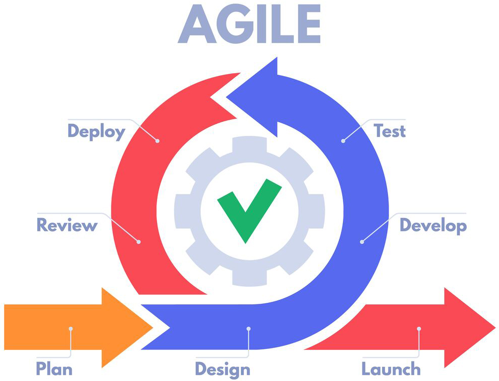
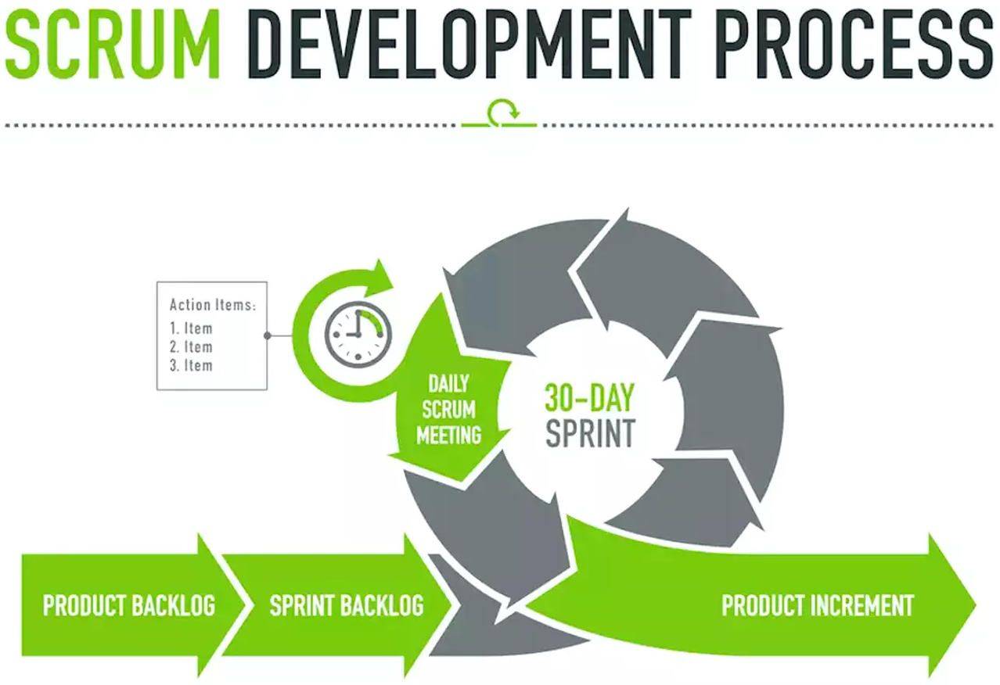
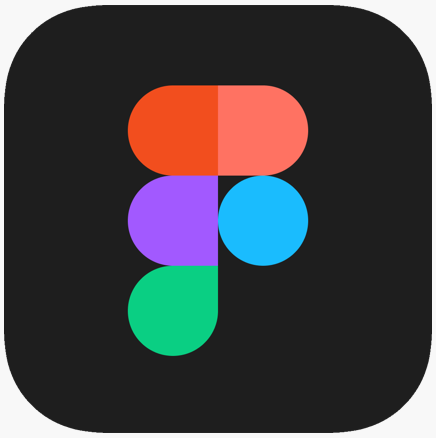

<h1> Hi there 👋 </h1>

  I'm  GRANIER Kévin  
  Junior Développeur FrontEnd / React  
  base in france near to Avignon.

  And here is my Github where you can see my personal projects

  <a href="https://www.kevin-granier.fr">Portfolio</a>🎨 
  /
  <a href="https://www.linkedin.com/in/kevin-granier-207487221">Linkedin</a>
  /
  <a href="https://www.malt.fr/profile/kevingranier">Malt</a>

<h4>My Languages and Tools:</h4>
<h5>FRONT :</h5>

  
  
  
  
  
  
  
  
  
  
  
  

<h5>BACK :</h5>

  
  
  

<h5>WEB SERVICE :</h5>

  
  
  
  
  

 
<h5>MÉTHODOLOGIE :</h5>

  
  

 
<h5>DESIGN :</h5>

  
  

 

<!--

-->

<!--

-->
